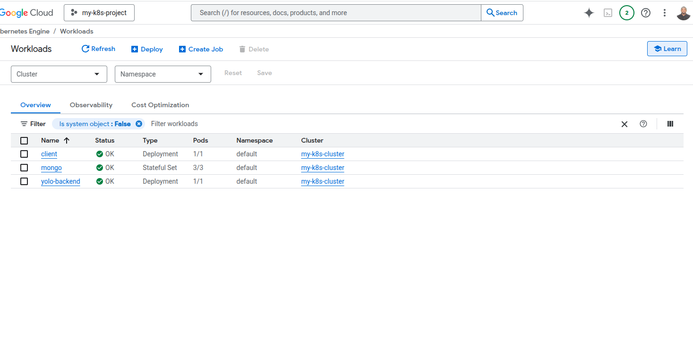

# Orchestartion of Containers using Kubernetes to deploy an Ecommerce App in Google Cloud
Project to deploy an ecommerce app to google cloud engine.To use kubernetes manifest files to create Objects to deploy the app.
## Prerequisites
- A Github account
- Dockerhub account
- Google Cloud account

## Screenshot


Step 1:Forking and cloning the repository
   Navigate to the link shared to fork the project
```bash
git clone https://github.com/boscokosgei/yolo.git
```
## Choosing the Kubernetes Object to Deploy the App
Create manifest files for deploymet and services 
```sh
   touch manifests/frontend-deployment.yaml
   touch manifests/backend-deployment.yaml
   touch manifests/mongo-statefulset.yaml 

```

  Create Service file to expose the frontend to public from port 3000 to 31000-32000 using load balancer
```sh
   touch manifests/backend-service.yaml
   touch manifests/frontend-service.yaml
   touch mongo-service.yaml
```
## Deploying The Application to Google Cloud Environment
 Step 1.Ensure you have the following Requirements
    Google Cloud Account
    Google Gloud Project
 Step 2 .Connect To GKE cluster from CLI
```gcloud container clusters get-credentials my-k8s-cluster --zone us-central1-a --project my-k8s-project-460220
```
 Step 3. Deplyoying the applicatio on Google cloud
 use the kubectl to deploy deployment file and services
 ```sh 
      kubectl apply -f manifests/mongo-statefulset.yaml
      kubectl apply -f manifests/backend-deployment.yaml
      kubectl apply -f manifests/frontend-deployment.yaml
 ```
 Step 4. Depending on the Cluster Resources you might need to minimize the cpus and memory if the pods arent running
  Check if the pods are runnning
  ```sh
      kubectl get pods
  ```
  After a few minutes, you should see the Pods in a Running state:
 ```sh
         NAME                            READY   STATUS    RESTARTS   AGE
         client-5dcf9bc58f-5vqpn         1/1     Running   0          153m
         mongo-0                         1/1     Running   0          169m
         mongo-1                         1/1     Running   0          169m
         mongo-2                         1/1     Running   0          169m
         yolo-backend-6565787bcc-wkj8f   1/1     Running   0          157m
 ```
## Screenshots
    Check for Containers deployed in Google cloud Cluster




